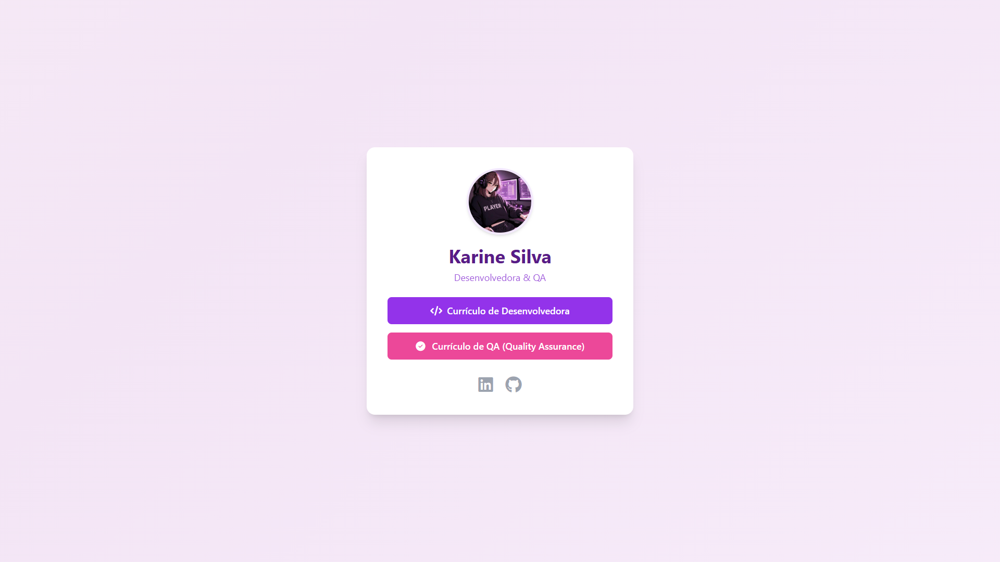
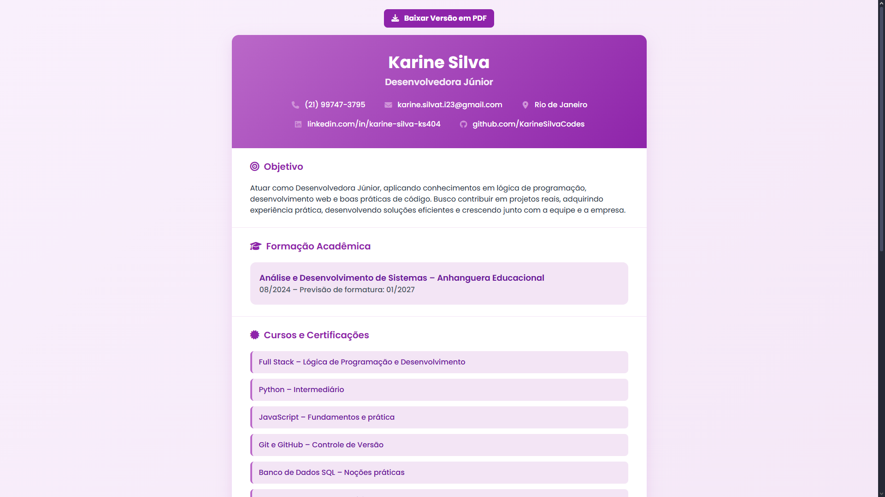

# 👋 Portfólio de Currículos | Karine Silva

Este repositório contém o código-fonte do meu site-portfólio pessoal, que serve como uma página de entrada (landing page) para meus currículos interativos de Desenvolvedora e Quality Assurance (QA).

Eu decidi criar meus currículos via código (HTML/CSS) para demonstrar minhas habilidades na prática, transformando o próprio currículo em um projeto de portfólio.

---

## 🚀 Acesse o Site!

O site está hospedado com GitHub Pages e pode ser acessado por qualquer pessoa (e qualquer recrutador) através do link abaixo:

### Prévia do Site

  
  
  

---

## 🛠️ Tecnologias Utilizadas

* **HTML5:** Estrutura semântica dos currículos e da página principal.
* **TailwindCSS:** Estilização moderna e responsiva (Utility-First).
* **Font Awesome:** Ícones utilizados nos botões e links sociais.
* **JavaScript (html2pdf.js):** Função de "Baixar PDF" implementada nos currículos.
* **GitHub Pages:** Hospedagem gratuita e deploy contínuo.

## 📂 Estrutura do Repositório

Este repositório é um "mini-site" organizado da seguinte forma:

* `/index.html`: É a página principal (o "cartão de visitas" com os links).
* `/Curriculo_DEV/`: Contém o `index.html` do meu currículo de Desenvolvedora.
* `/Curriculo_QA/`: Contém o `index.html` do meu currículo de Quality Assurance.

## 📬 Fale Comigo

Obrigada pela visita!

---

## 📜 Licença e Copyright

Todo o código, design e layouts deste repositório são de minha autoria e estão protegidos por direitos autorais.

Este projeto é **exclusivamente para fins de portfólio**.

Não é permitida a cópia, distribuição ou modificação do código para uso em outros projetos, pessoais ou comerciais, sem minha permissão explícita. Se você gostou do que viu, sinta-se à vontade para se inspirar, **mas crie o seu próprio!**

© 2025 Karine Silva. Todos os direitos reservados.